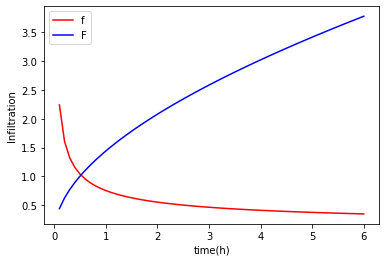
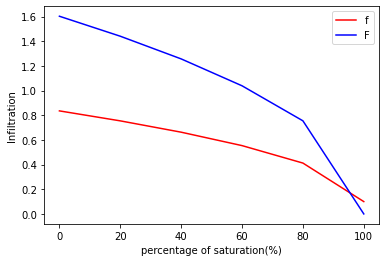

```python
import xarray as xr
import cartopy.crs as ccrs
import cartopy.feature as cfeature
import matplotlib.pyplot as plt
import numpy as np
import geopandas as geo
import cmaps 
from cartopy.util import add_cyclic_point
from cdo import Cdo
cdo = Cdo()
```


```python
t = np.arange(0.1, 6.1, 0.1)
```


```python
F_box = np.zeros(60)
```


```python
for i in np.arange(60):
    t0 = t[i]
    F = 0.1*t0
    for j in np.arange(1000):
        F = 0.1*t0+9.43488*np.log(1+(F/9.43488))
    F_box[i] = F
```


```python
f_box = np.zeros(60)
```


```python
f_box = 0.1*((9.43488/F_box)+1)
```


```python
f_box
```


    array([2.23901407, 1.60301551, 1.3213075 , 1.15340498, 1.03884213,
           0.95428956, 0.88858632, 0.83563325, 0.7917787 , 0.75468515,
           0.72277771, 0.69495139, 0.67040498, 0.64854147, 0.62890565,
           0.6111436 , 0.59497539, 0.58017635, 0.56656376, 0.55398733,
           0.54232212, 0.5314633 , 0.5213222 , 0.51182321, 0.50290141,
           0.49450073, 0.48657242, 0.4790739 , 0.47196776, 0.465221  ,
           0.45880438, 0.45269189, 0.44686028, 0.44128873, 0.43595853,
           0.43085277, 0.42595617, 0.42125487, 0.41673625, 0.41238882,
           0.40820207, 0.40416635, 0.40027284, 0.39651339, 0.39288051,
           0.38936728, 0.38596729, 0.38267459, 0.3794837 , 0.37638948,
           0.37338716, 0.3704723 , 0.36764076, 0.36488864, 0.36221233,
           0.35960841, 0.35707369, 0.35460517, 0.35220004, 0.34985563])


```python
fig = plt.figure()
ax = fig.add_subplot(1, 1, 1)

ax.set_xlabel('time(h)')
ax.set_ylabel('Infiltration')

# plot the function
ax.plot(t,f_box, 'r', label='f')
ax.plot(t, F_box, 'b', label='F')
ax.legend()

# show the plot
plt.show()
fig.savefig('/Users/hushixiong/Desktop/courses/ENV5810/homework7-Q3.png')
```


    

    


```python
t = 1
F_box = np.zeros(6)
f_box = np.zeros(6)
```


```python
percent = [0, 20, 40, 60, 80]
```


```python
product
```


    2.3587199999999995


```python
# TIME IS FIXED AT 1 HOUR!
for i in np.arange(5):
    delta = (1-(percent[i]/100))*0.432
    product = delta*27.3
    F = 0.1
    for j in np.arange(1000):
        F = 0.1*1+product*np.log(1+(F/product))
    F_box[i] = F
    f_box[i] = 0.1*((product/F)+1)
```


```python
f_box[5] = 0.1*1 #fully saturated, delta = 0; 
F_box[5] = 0
```


```python
fig = plt.figure()
percent = [0, 20, 40, 60, 80, 100]
ax = fig.add_subplot(1, 1, 1)

ax.set_xlabel('percentage of saturation(%)')
ax.set_ylabel('Infiltration')

# plot the function
ax.plot(percent,f_box, 'r', label='f')
ax.plot(percent, F_box, 'b', label='F')
ax.legend()

# show the plot
plt.show()
fig.savefig('/Users/hushixiong/Desktop/courses/ENV5810/homework7-Q3_2.png')
```


    

    


```python

```
